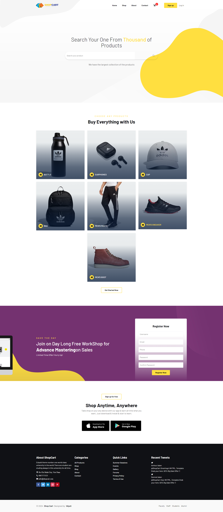
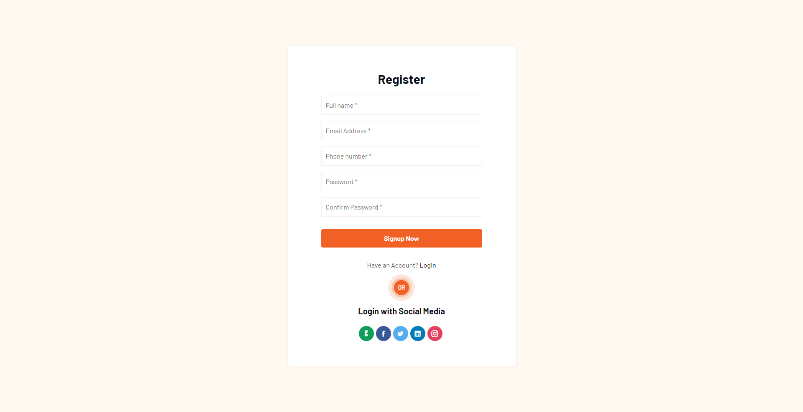
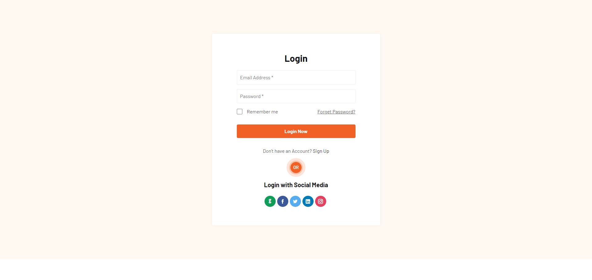
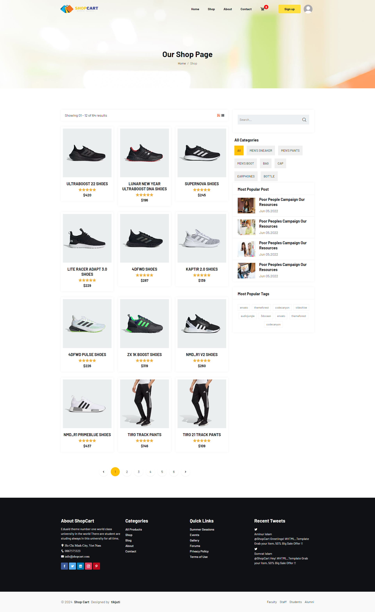
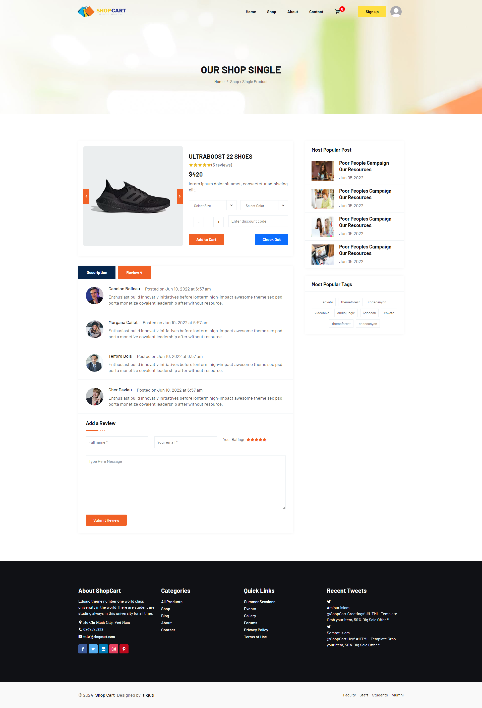
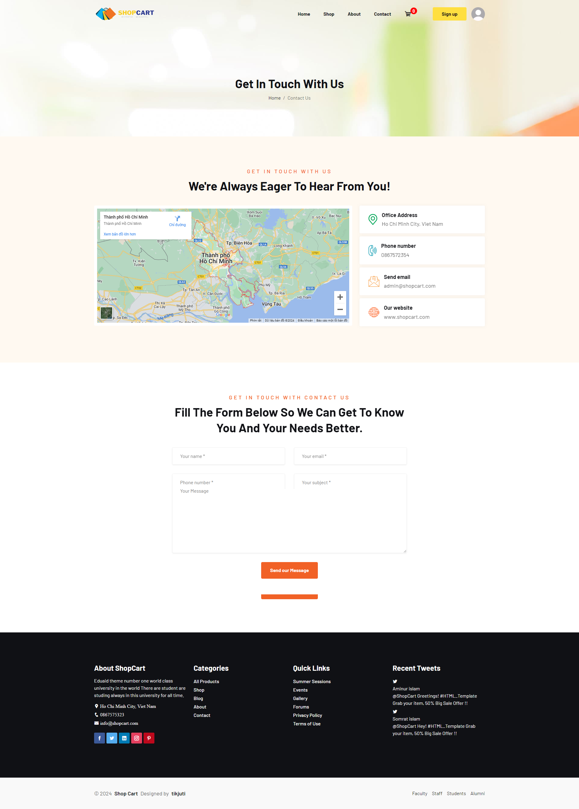
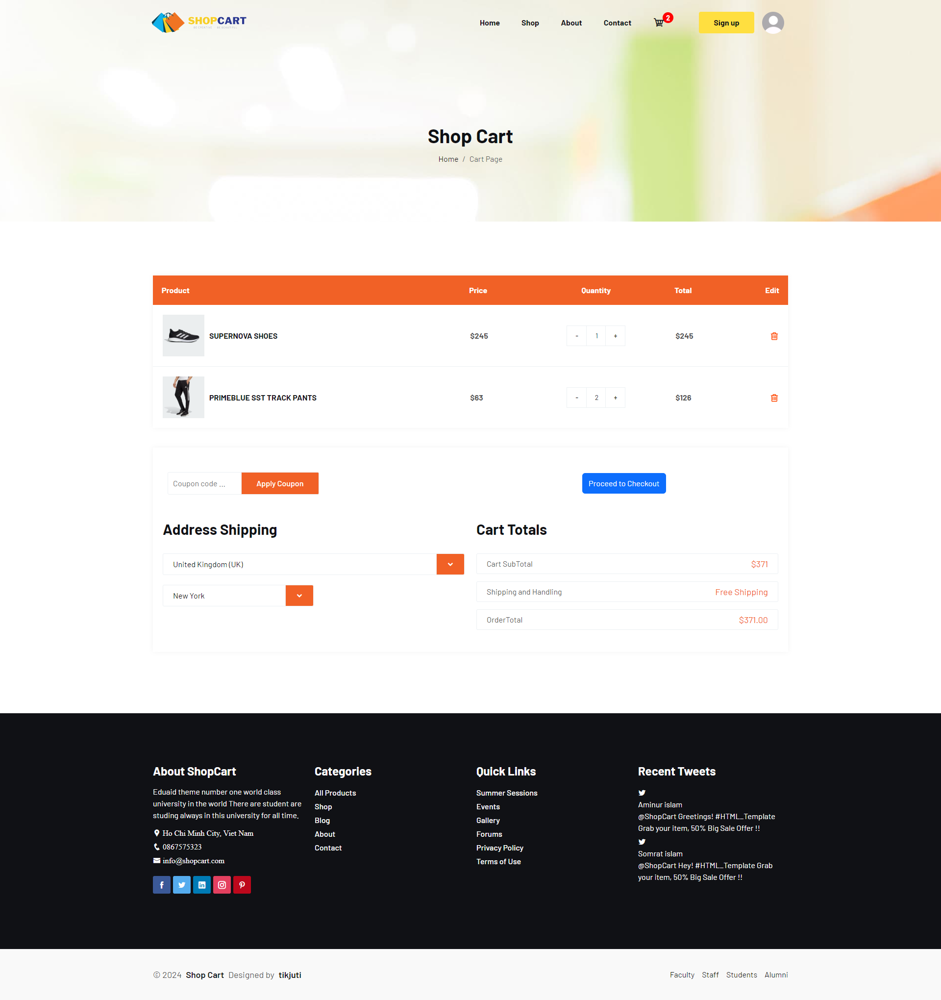
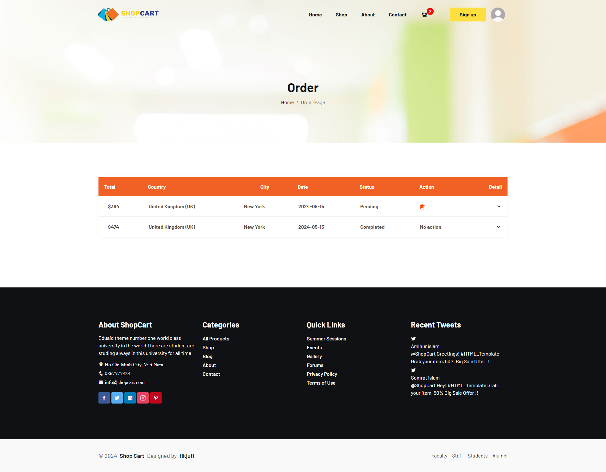
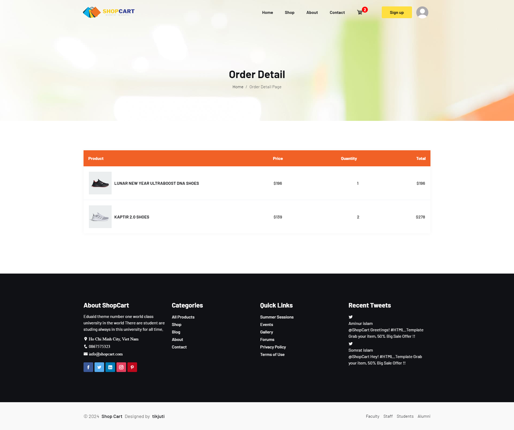

# eCommerce-website
## Getting started
### Download project
1. Change into the project directory: 
 ```bash
   git clone https://github.com/tikjuti/eCommerce-website.git
   ```
2. Navigate to the project directory: 
 ```bash
   cd eCommerce-website
   ```
### Start client

1. Change into the client directory: 
 ```bash
   cd client
   ```
2. Install npm dependencies:
 ```bash
   npm install
   ```
3. Install npm dependencies:
 ```bash
   npm run dev
   ```
### Start server

1. Change into the project directory:
 ```bash
   cd server
   ```
2. Create the virtual environment:
 ```bash
   python3 -m venv env (for windows --> python -m venv env)
   ```
3. Activate the virtual environment:
 ```bash
   source env/bin/activate (for windows --> env\scripts\activate)
   ```
4. Install packages:
 ```bash
   pip install -r requirement.txt (same for both)
   ```
5. Update the database:
 ```bash
   python manage.py migrate
   ```
6. Start the server:
 ```bash
   python manage.py runserver
   ```
## Overview
#### 1. Home page


<h3 align="center">H1. Home Page</h3>

#### 2. Register


<h3 align="center">H2. Register</h3>

#### 3. Login


<h3 align="center">H3. Login</h3>

#### 4. Shop Page


<h3 align="center">H4. Shop Page</h3>

#### 5. Detail Product


<h3 align="center">H5. Detail Product</h3>

#### 6. About Page


<h3 align="center">H6. About Page</h3>

#### 7. Contact Page


<h3 align="center">H7. Contact Page</h3>

#### 8. Cart Page


<h3 align="center">H8. Cart Page</h3>

#### 9. Order Page


<h3 align="center">H9. Order Page</h3>

#### 10. Detail Order


<h3 align="center">H10. Detail Order</h3>


